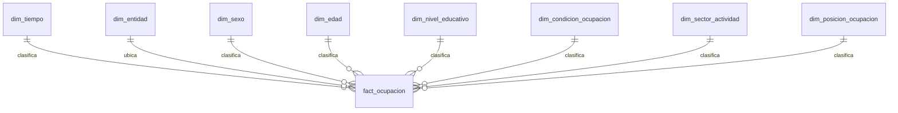

# Diseno centralizado

El modelo centralizado usa una tabla de hechos, `fact_ocupacion`, y dimensiones para tiempo, entidad, sexo, edad, nivel educativo, condicion de ocupacion, sector y posicion en la ocupacion. Este diseno evita repetir descripciones textuales en millones de filas y permite explicar normalizacion hasta 3FN.

La tabla `fact_ocupacion` conserva las llaves foraneas y las metricas numericas. Las dimensiones representan catalogos o atributos que se repiten, por lo que su separacion reduce redundancia.
